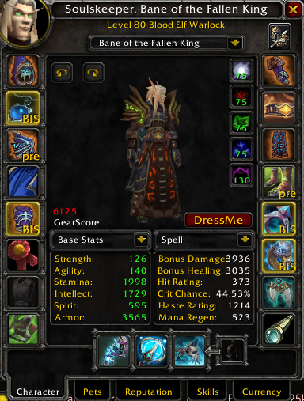

# SM BiS Addon by Lqlqdum

## Overview
The **SM BiS Addon** is a World of Warcraft Classic addon that displays "BIS" (Best in Slot) and "Pre-BIS" tags on items in your character window, helping you quickly identify which items match your optimal gear list. The addon adapts to your class and specialization, loading the appropriate BIS lists for your character.



## Features
- Detects your class and specialization based on talent points.
- Displays **BIS** or **Pre-BIS** tags on equipped items that match your Best in Slot list.
- Supports multiple classes and specializations.
- Customizable BIS lists can be edited or extended as needed.

## Installation
1. Download the addon and extract it to your `World of Warcraft/_classic_/Interface/AddOns` folder.
2. Ensure the folder structure looks like this:
   ```
   World of Warcraft
   └── _classic_
       └── Interface
           └── AddOns
               └── BIS_Core
                   ├── display_bis.lua
                   ├── shaman.lua
                   ├── warrior.lua
                   ├── paladin.lua
                   └── ... (other class files)
   ```
3. Restart WoW and ensure the addon is enabled in the AddOns menu.

## Usage
1. Open your character window in-game (`C` by default).
2. Items in your equipment slots will show:
   - **BIS**: If the item matches your Best in Slot list.
   - **Pre-BIS**: If the item matches your Pre-BIS list.

## How It Works
- The addon determines your class and specialization using the WoW API.
- It then loads the appropriate BIS and Pre-BIS lists from class-specific Lua files.
- If an equipped item matches your BIS or Pre-BIS lists, the addon displays the corresponding tag in the character window.

## Customization
### Adding or Modifying BIS Lists
To add or modify BIS lists:
1. Open the class-specific Lua file in a text editor (e.g., `shaman.lua`).
2. Add or edit entries in the `BIS` and `PreBIS` tables using the following format:
   ```lua
   BIS = {
       [itemID] = true, -- Description (e.g., Sanctified Frost Witch's Faceguard)
       ...
   },
   PreBIS = {
       [itemID] = true, -- Description
       ...
   }
   ```
3. Save the file and reload the UI in-game with `/reload`.

## Troubleshooting
1. **Addon not showing BIS tags?**
   - Ensure the addon is installed in the correct folder.
   - Check the game's AddOns menu to verify the addon is enabled.
   - Reload the UI (`/reload`) after making changes.

2. **Error: `attempt to call global 'require' (a nil value)`?**
   - The addon now uses global variables to load class-specific BIS lists. Ensure the `shaman.lua` and other class files are loaded as part of the addon.

3. **Need help with an issue?**
   - Feel free to open an issue on [GitHub](https://github.com/stlevkov/BIS_Core).

## Credits
- **Author**: [Lqlqdum](https://github.com/stlevkov)
- Inspired by the need for an easy-to-use BIS tracking tool in WoW Classic.
